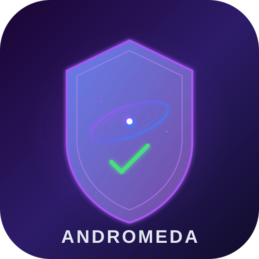

# Andromeda v4.0

**Ultimate Jailbreak Detection Bypass for Dating Apps & Social Media**



## Overview

Andromeda is a comprehensive jailbreak detection bypass tweak that neutralizes all known detection methods used by modern dating and social media applications. It combines techniques from Shadow, Choicy, vnodebypass, and DBS bypass into a single, unified solution.

## Supported Applications

### Dating Apps (Maximum Protection)
- **Hily** - Full bypass including HLYSecurityManager, HLYDeviceIntegrity, HLYRuntimeSecurity, HLYFingerprintManager, HLYTrustEvaluator
- **Tinder** - TNDRUser ban checks, TNDRDeletionDetector, TNDRMetaManager, TNDRSecurityManager
- **Bumble** - BMBLDeviceChecker, BMBLSecurityManager, BMBLAccountManager
- **Badoo** - BDODeviceInfo, BDOSecurity
- **Fruitz** - FRZSecurityCheck, FRZIntegrityValidator
- **Feels** - FLSSecurityManager, FLSIntegrityCheck, FLSDeviceFingerprint
- **Hinge** - HNGDeviceCheck, HNGSecurityIntegration
- **Grindr** - GRDRSecurityManager
- **Happn** - HPNDeviceSecurity
- **OKCupid** - OKCDeviceCheck
- **Meetic** - MTCSecurityManager

### Social Media Apps (Maximum Protection)
- **Instagram** - IGSecurityManager, IGIntegrityCheck, FBAnalytics, FBDeviceInformation, IGUserSession
- **Threads** - THAppSecurityManager, THDeviceIntegrity, THSecurityCheck
- **Facebook** - FBSecurityManager, FBDeviceCheck
- **Snapchat** - SCSecurityManager, SCDeviceCheck
- **TikTok** - TTSecurityManager, TTDeviceCheck

## Detection Methods Neutralized

### 1. Filesystem Detection
- `stat`, `lstat`, `statfs`, `access`, `open`, `fopen`, `readdir`, `fcntl`
- `mount`, `truncate`, `unlink`, `rename`, `chmod`, `chown`, `link`, `symlink`, `readlink`, `mkdir`, `rmdir`
- `getdirentries64` with directory entry filtering
- `NSFileManager` (fileExistsAtPath, contentsOfDirectory, attributesOfItem, etc.)
- `NSFileHandle`, `NSFileVersion`, `NSFileWrapper`

### 2. Dynamic Library Detection
- `dlopen` blocking of suspicious libraries
- `dlsym` filtering of hook symbols (MSHook*, fishhook_*, etc.)
- `dladdr` spoofing for suspicious addresses
- `_dyld_get_image_name` masking
- `objc_copyImageNames` filtering
- `class_getImageName` spoofing
- `NSBundle` enumeration filtering

### 3. Anti-Debugging
- `ptrace` (PT_DENY_ATTACH, PT_ATTACH)
- `csops` (CS_DEBUGGED flag clearing)
- `sysctl` (P_TRACED flag clearing)
- `sysctlbyname` (kern.bootargs, hw.machine spoofing)
- `fork`, `vfork` blocking
- `task_get_exception_ports` blocking
- `task_info` monitoring
- `system`, `popen` command filtering

### 4. DeviceCheck & App Attest
- `DCAppAttestService` (isSupported, generateKey, attestKey, generateAssertion)
- `LAContext` (canEvaluatePolicy)
- `SecTaskCopyValueForEntitlement` (get-task-allow, task_for_pid-allow)
- 35+ known jailbreak detection SDK classes

### 5. Hardware Fingerprinting
- `uname` (machine, release, version spoofing)
- `gethostuuid` (UUID spoofing)
- `UIScreen` (bounds, nativeBounds, scale)
- `UIDevice` (model, uniqueIdentifier, identifierForVendor, systemVersion)
- `IOKit` (IORegistryEntryCreateCFProperty, IORegistryEntryCreateCFProperties)
- `MobileGestalt` (MGCopyAnswer for ProductType, SerialNumber, UniqueDeviceID, etc.)

### 6. Sandbox & Mach
- `sandbox_check` (file-read, file-write, mach-lookup)
- `sandbox_check_by_audit_token`
- `bootstrap_look_up` (blocking jailbreak services)
- `bootstrap_look_up2`

### 7. Behavioral Biometrics
- `UITouch` (locationInView, previousLocationInView, timestamp, force)
- `UIEvent` (timestamp)
- `UIGestureRecognizer` (locationInView, translationInView, scale, rotation)
- `UIPanGestureRecognizer` (velocityInView)
- `UISwipeGestureRecognizer` (locationInView)

### 8. Network & Sensors
- `getifaddrs` (MAC address spoofing)
- `CMMotionManager` (accelerometer, gyro, magnetometer)
- `AVCaptureDevice` (flash, torch)
- `CLLocationManager` (location services)

### 9. Runtime Integrity
- `objc_getClassList` (hiding tweak classes)
- `NSThread` (callStackReturnAddresses, callStackSymbols)
- `syscall` (SYS_ptrace, SYS_fork, SYS_csops)
- `vm_region`, `vm_region_64` (memory protection spoofing)

### 10. URL Scheme & Environment
- `UIApplication.canOpenURL` (blocking cydia, sileo, filza, etc.)
- `UIApplication.openURL`
- Environment variable cleaning (DYLD_*, CYDIA, Substrate, etc.)

## Installation

### Prerequisites
- iOS 12.0 or later
- Jailbroken device (checkra1n, unc0ver, Taurine, Dopamine, palera1n, etc.)
- Substrate, Substitute, or ElleKit

### From .deb
```bash
dpkg -i com.andromeda.bypass_4.0.0_iphoneos-arm.deb
# or
apt install ./com.andromeda.bypass_4.0.0_iphoneos-arm.deb
```

### From Source (requires Theos)
```bash
# Install Theos if not already installed
git clone --recursive https://github.com/theos/theos.git ~/theos
export THEOS=~/theos

# Build
cd Andromeda
./build.sh

# Install
dpkg -i com.andromeda.bypass_4.0.0_iphoneos-arm.deb
```

## Configuration

After installation, open **Settings > Andromeda** to configure:

- **Enable Andromeda** - Master toggle
- **Dating Apps Protection** - Enable dating app specific bypasses
- **Bypass App Attest** - Disable DCAppAttestService
- **Bypass Behavioral Biometrics** - Add organic variance to touches
- **Filesystem Hooks** - Hide jailbreak files
- **Dyld/Runtime Hooks** - Hide injected libraries
- **Anti-Debug Hooks** - Block debugging detection
- **DeviceCheck Hooks** - Bypass known SDK detection
- **Sandbox Hooks** - Bypass sandbox checks
- **URL Scheme Filtering** - Block jailbreak URL schemes
- **Environment Variable Cleaning** - Remove suspicious env vars
- **Syscall Hooks** - Block suspicious syscalls
- **Mach Bootstrap Hooks** - Block jailbreak mach services
- **Hardware Fingerprint Spoofing** - Spoof device identifiers
- **IOKit Spoofing** - Spoof IOKit properties
- **Hide Tweak Classes** - Hide tweak classes from runtime
- **Symbol Lookup Filtering** - Block hook symbol lookup
- **ObjC Runtime Hooks** - Hook ObjC runtime functions
- **Vnode Bypass** - Hide files at vnode level
- **Apply to All Apps** - Apply bypass to all apps (not just dating/social)

## Architecture

```
Andromeda/
├── Andromeda.framework/          # Core framework
│   ├── Core.m                    # Main logic + app detection
│   ├── DetectionSignatures.m     # 100+ detection signatures
│   ├── DeviceFingerprintSpoofer.m # Hardware spoofing
│   └── Headers/
│
├── Andromeda.dylib/              # Injectable tweak (28 hook modules)
│   ├── dylib.x                   # Entry point + dispatch
│   └── hooks/
│       ├── Filesystem.x          # 20+ filesystem hooks
│       ├── Dyld.x                # dylib/runtime hooks
│       ├── AntiDebug.x           # Anti-debugging hooks
│       ├── DeviceCheck.x         # 35+ SDK class hooks
│       ├── AppAttest.x           # App Attest bypass
│       ├── HardwareFingerprint.x # Hardware spoofing
│       ├── IOKit.x               # IOKit property spoofing
│       ├── Sandbox.x             # Sandbox bypass
│       ├── URLScheme.x           # URL scheme filtering
│       ├── EnvVars.x             # Environment cleaning
│       ├── MachBootstrap.x       # Mach service blocking
│       ├── ObjCRuntime.x         # ObjC runtime hooks
│       ├── Syscall.x             # Syscall blocking
│       ├── TweakClasses.x        # Class hiding
│       ├── SymLookup.x           # Symbol lookup filtering
│       ├── VnodeBypass.x         # Memory region hooks
│       ├── UIImage.x             # File I/O hooks
│       ├── Sensors.x             # Sensor spoofing
│       ├── MobileGestalt.x       # MobileGestalt spoofing
│       ├── NetworkInterface.x    # MAC address spoofing
│       ├── ProcFiles.x           # /proc access blocking
│       ├── IOHID.x               # HID hooks
│       ├── Behavioral.x          # Touch/gesture spoofing
│       ├── DatingApps.x          # Dating app specific hooks
│       └── SocialApps.x          # Social app specific hooks
│
└── AndromedaSettings.bundle/     # Settings panel
    ├── RootListController.m
    └── Resources/
        ├── Root.plist
        ├── Info.plist
        └── Icons/
```

## Compatibility

- **iOS Versions**: 12.0 - 18.x
- **Jailbreaks**: checkra1n, unc0ver, Taurine, Dopamine, palera1n, XinaA15, Fugu15
- **Hooking Libraries**: Substrate, Substitute, ElleKit, libhooker
- **Architectures**: arm64, arm64e

## Troubleshooting

### App still detects jailbreak
1. Respring after installation
2. Force quit the app and reopen
3. Check Settings > Andromeda to ensure all hooks are enabled
4. Try disabling other tweaks that might conflict
5. Use Choicy to disable all tweaks except Andromeda for the target app

### App crashes on launch
1. Check Console.app for crash logs
2. Try disabling specific hook categories in Settings
3. Ensure you're using a compatible hooking library
4. Try using fishhook instead of Substrate for C function hooks

### Accounts get banned
1. Andromeda bypasses detection but doesn't prevent server-side bans
2. Avoid suspicious behavior (rapid swiping, mass messaging)
3. Use a clean device profile
4. Don't use automation tools

## Legal

This software is provided for educational and research purposes only. Use at your own risk. The authors are not responsible for any consequences of using this software.

## Credits

- Shadow by jjolano - Filesystem and dyld hook techniques
- Choicy by opa334 - Tweak injection control
- vnodebypass - Kernel-level file hiding concepts
- DBS bypass - Runtime swizzling approach

## License

BSD-3-Clause
